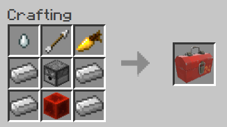

# TF2 dispenser mod for Minecraft v1.0

The purpose of this mod is to add the dispenser from Team Fortress 2 to Minecraft.
In Team Fortress 2, the dispenser heals nearby players and replenishes their ammo.

# Features
Standing near(within one block of) the dispenser provides some convenient benefits, namely:

Healing
  - Health will regenerate much faster

Saturation
  - Your hunger will fade away, and you'll be saturated for a long time

Refill ammo
  - The dispenser makes sure you always have a full stack of arrows in your inventory
  - dispenses about 1 arrow per second
  - As long as you have less than 64 arrows in your inventory

# Crafting recipe

Ingredients:
  - 1x Ghast tear
  - 1x Arrow
  - 1x Golden carrot
  - 1x Dispenser
  - 1x Redstone block
  - 4x Iron ingot

# Dispenser properties
Blast resistance
  - Extremely tough block, untouchable by explosions
  - Same as blocks like obsidian or anvils
  - Blast resistance: 6000
  
Harvesting
  - Can be broken by anything, even bare fists
  - Only drops dispenser item when broken with an iron or diamond pickaxe
  - Harvest level: 2

Hardness
  - Hardness level: 5
  - Same as iron blocks or enchantment tables

Light level
  - The dispenser emits a dim glow
  - light level: 6
  - like a dim redstone torch

Lastly, the dispenser does not serve players in creative mode.

# Versions
Minecraft version: 1.12.2
Forge version: 1.12.2-forge1.12.2-14.23.3.2698

# Installation instructions
  - Install the correct Minecraft and Forge versions.
  - Use the Dispensermod-1.0.jar file from the root directory, or import the project and build the jar. 
  - Put the .jar in your .minecraft/mods folder.
  - In your Minecraft launcher, select the Forge profile, and launch the game.
  
The dispenser can be crafted, or found under the "Redstone" tab in creative mode.

In this tab, a wrench can be found next to the dispenser. This item does not have a function in this version of the mod.
